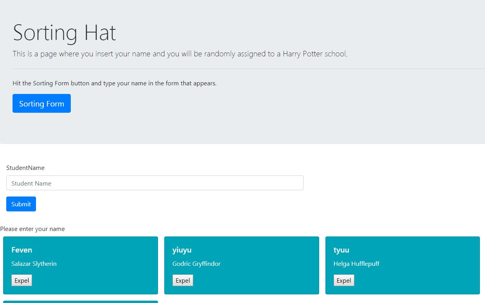

### Sorting-Hat
This project was a great one to practice javascript specially event handler  
The page first will have some information about what the page is about and a button.
The sorting button will display a form for the user to enter their name.  
And when the user enters their name and click submit button a card with their name and school they and assigned to will appear.  


## Screenshots



## How to run this project:

* Use nmp to install htpp-server:

```sh

npm install -g http-server

```
* Run the server:

```sh

hs -p 9999

```

* Open Chrome and navigate to:

```

localhost:9999

```
